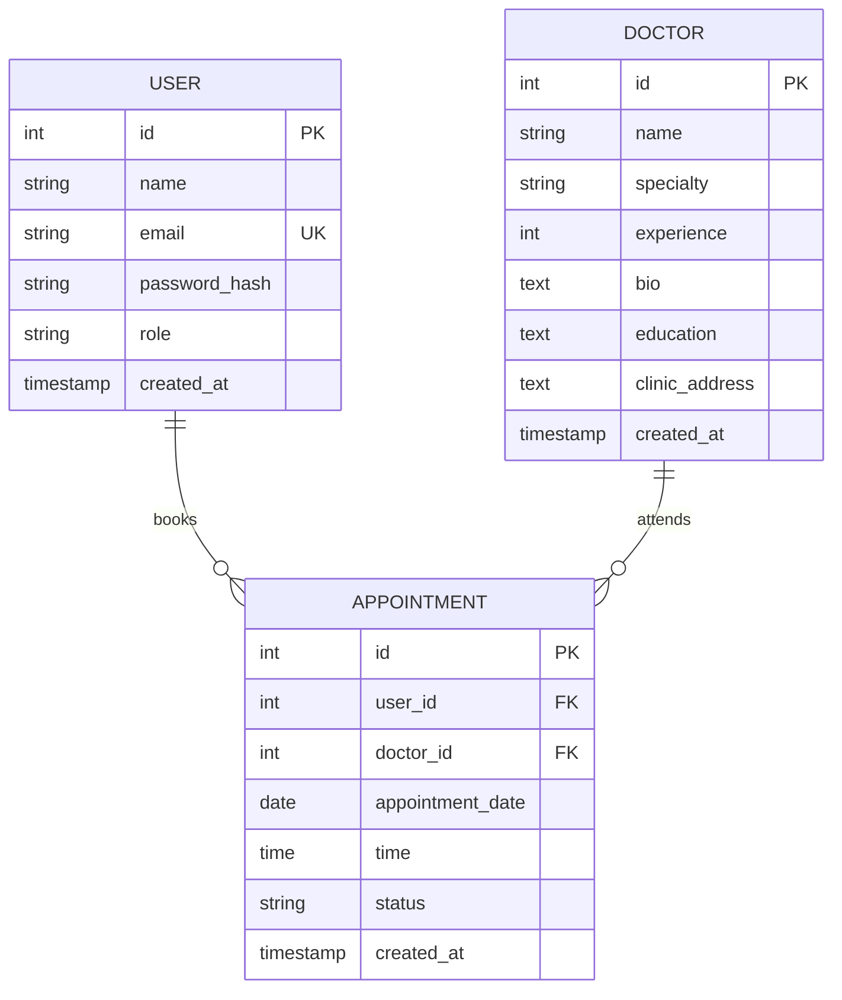

# Entity-Relationship (ER) Diagram
**Project: Doctor Booking Application**

This diagram represents the logical structure of the database, showing the tables and how they relate to one another.

---

## Relationship Descriptions
1.  **Users to Appointments (1:N)**: A single user (patient) can book multiple appointments over time, but each appointment is linked to exactly one user.
2.  **Doctors to Appointments (1:N)**: A single doctor can have many appointments with different patients, but each appointment belongs to only one doctor.
3.  **Appointment Constraints**: 
    - The `user_id` must exist in the `users` table.
    - The `doctor_id` must exist in the `doctors` table.
    - This ensures data integrity and prevents "ghost" appointments.
